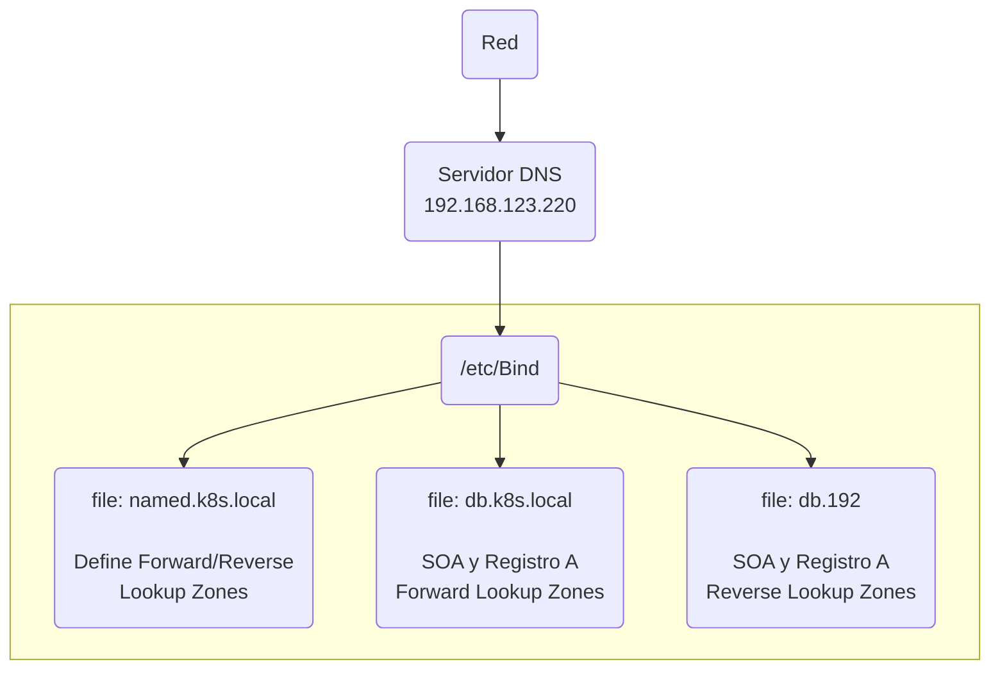

# Implementando Kubernetes en Máquinas Virtuales VMWare con Ubuntu 22.04.

## Creando la Máquina Virtual K8S DNS.

|Servidor        |HostName             |CPU          |RAM |IP              | HDD                          | Comentarios      |
|----------------|---------------------|-------------|----|----------------|------------------------------|------------------|
|DNS K8s         |k8sdns.k8s.local     |1vCPU 2 Core |4gb |192.168.123.220 |20GB                          |Salida a Internet |

* Ejecutamos VMWare WorkStation
* Menú **File** opción **New Virtual Machine Wizard**
* Seleccionamos la opción **Custom (Advanced)**
	* Presionamos botón **Next**.
* Selecionamos la versión de **Hardware Compatibility** (en este caso estoy trabajando con WorkStation 16.2.x.).
	* Presionamos botón **Next**.
* Buscamos y Seleccionamos la imagen Ubuntu que utilizaremos, en este caso la versión **ubuntu-22.04.2-desktop-amd64.iso**.
	* Presionamos botón **Next**.
* Identificamos la información de la instalación. (Los siguientes valores son recomendaciones)
	* **Full Name:** K8s DNS
	* **User Name:** k8sdevops
	* **Password:** k8sdevops
	* **Confirm:** k8sdevops
	* Presionamos botón **Next**.
* Ingresamos el nombre de la máquina virtual.
	* **Virtual machine name:** K8sDNS
	* **Location**: \VMK8s_Cluster\K8sDNS
	* Presionamos botón **Next**.
* Seleccionamos los siguientes parámetros.
	* **Number of Processors:** 1
	* **Number of cores per processor:** 2
	* Presionamos botón **Next**.
* Seleccionamos **4Gb** o escribimos en **Memory fior this virtual machine:** 4096 **MB**.
	* Presionamos botón **Next**.
* Seleccionamos **Use network address translation (NAT)** .
	* Presionamos botón **Next**.
* Seleccionamos **LSI Logic (Recommended)** .
	* Presionamos botón **Next**.
* Seleccionamos **Use network address translation (NAT)** .
	* Presionamos botón **Next**.
* Seleccionamos **SCSI (Recommended)** .
	* Presionamos botón **Next**.
* Seleccionamos **Create a new virtual disk** .
	* Presionamos botón **Next**.
* Ingresamos **Maximum disk size(Gb):** 20.0.
	* Seleccionamos **Allocate all disk space now**.
	* Seleccionamos **Split virtual disk into multiple files**.
	* Presionamos botón **Next**.
* Asignamos la ruta de disco para la máquina virtual.
	* Buscamos, en **Disk file:** \VMK8s_Cluster\K8sDNS\VirtualDisk
	* Presionamos botón **Next**.
* Ya henos llegado a la parte final para la creación de la máquina virtual.
	* Presionamos botón **Finish**.

>Ahora ha esperar que se cree el disk virtual y el servidor **Ubuntu**. Esto dependiendo de tu notebook o pc o server, alrededor de 5 min.

Una ves iniciado el servidor **Ubuntu**, seleccionar los siguientes parámetros que recomiendo:

* **Keyboard layout**.
	* **Choose your keyboard layout:** Spanish (Latin American).
	* **Spanish (Latin American)**
	* Presionamos botón **Continue**.

* **Updates and Other software**.
	* Seleccionamos **Normal installation**.
	* Seleccionamos **Download updates while installing Ubuntu**
	* Presionamos botón **Continue**.

* **Installation type**.
	* Seleccionamos **Erase disk and install Ubuntu**.
	* Presionamos botón **Install now**.
	* Presionamos botón **Continue**.

* **Who are you?**.
* Identificamos la información del servidor. (Los siguientes valores son recomendaciones)
	* **Your name:** K8s DNS
	* **Your computer's name:** k8sdns.k8s.local
	* **Pick a username:** k8sdevops
	* **Choose a password:** k8sdevops
	* **Confirm your password:** k8sdevops
	* Presionamos botón **Continue**.

Se inicia la instalación de Ubuntu 22.04. Tiempo de espera aproximadamente 5 min.

* **Installation Complete**.
	* Presionamos botón **Restart Now**.
Una vez reiniciada la máquina virtual, seleccione el usuario **K8S DNS** e ingrese la clave **k8sdevops** o la ingresada en el momento de la instalación.

Si solicita **Online Account**, presiones **Skip**, **Next**, **Next**, **Next** ,**Done**.

A esta altura estaremos Ok para comenzar a trabajar en nuestra máquina virtual de **Kubernetes Master**

## Comenzamos con la Instalación del DNS.
Ahora comenzaran una serie de comandos que deberás ejecutar para la instalación del Cluster Kubernetes.
>Se profundizaran en algunos comandos Linux para comentar su ejecución, dado que se entiende que es conocedor de este Sistema Operativo.

>Si desea omitir esta serie de comandos, se implemento un Shell Linux que realiza en modo Batch esta instalación con mensajes del proceso que esta ejecutándose (install_k8smaster.sh).

Debemos ingresar a una Terminal.
### 1. Actualizamos el Ubuntu 22.04.

```
$ sudo apt update
$ sudo apt -y full-upgrade

$ sudo reboot -f
```

**Esperamos que reinicie la máquina virtual. ingresamos a Linux y abrimos una Terminal.**

### 2. Asignamos la IP Fija a la máquina virtual, en este caso 192.168.123.220.

* Buscamos el aplicativo **Network**.
	* Nos vamos a ruedita de configuración.
	* En los TAB **Wired**, seleccionamos **IPv6** y seleccionamos **Disable** 
	* Vamos al TAB **IPv4** y seleccionamos **Manual** e ingresamos los siguientes parámetros:
		* **Addresses**
			* **Address:** 192.168.123.220
			* **Netmask:** 255.255.255.0
			* **Gateway:** 192.168.123.2 (Esta puede variar según la red a implementar)
		* **DNS:** 192.168.123.220,8.8.8.8,8.8.4.4  (La ip 192.168.123.220, corresponde al DNS k8s, asignar la que posee la organización o localmente. Sino, se creara un DNS local posteriormente en esta implementación)
	* Presionamos botón **Apply**.
	* Apague la **Wired** y vuelva a encender, así nos aseguramos que estamos Ok con la asignación de IP. Este paso es recomendable si esta en un infraestructura propietarias, sino podría perder conectividad con el servidor.

### 3. Asignamos correctamente el nombre del hostname.

```
$ sudo hostnamectl set-hostname "k8sdns.k8s.local"
$ hostname
```

### 4. Editemos el archivo hosts de nuestro Ubuntu *K8sdns*.

```
$ sudo vi /etc/hosts
192.168.123.220 k8sdns.k8s.local k8sdns
```
Además comentaremos la siguiente línea con un `#`:

```
#127.0.1.1      k8sdns.k8s.local      k8sdns
```

Grabamos y salimos del editor.

## Iniciando el Servicio DNS.
Una explicación de como funciona este servicio. Es muy simple de configurar, lastima que no tiene ningún GUI o Portal de Administración bueno bueno que nos entregue un UX como se está acostumbrado en un servicios Cloud.

Si deseas utilizar este DNS que implementaremos en tu infraestructura o red, deberás considerar que tus que esos equipos consideren este DNS para la resolución de nombres (IP: 192.168.123.220).


Crearemos 3 archivos descritos en la grafica anterior, posterior a la instalación del paquete Bind9.

### 1. Instalando el paquete Bind9.

```
$ sudo apt install -y bind9
$ sudo apt install -y dnsutils
```

### 2. Configurando Bind9.

```
$ sudo su -
$ cd /etc/bind
```

Definimos los servidores DNS principales, ISP, IEU entre otros, lo cual reenviará la consulta solicitado si no la encuentra.

```
$ sudo vi /etc/bind/named.conf.options
```

Descomentariamos y reemplazamos con estos valores.

```
        forwarders {
         192.168.123.254;
         8.8.8.8;
         8.8.4.4;
        };
```
Reiniciamos los servicios.

```
$ sudo systemctl restart bind9
$ sudo systemctl status bind9
```

```
$ sudo vi /etc/bind/named.conf.local
```

Agregamos al final del archivo.

```
zone "k8s.local" {
    type master;
    file "/etc/bind/db.k8s.local";
};
```
```
$ sudo cp /etc/bind/db.local /etc/bind/db.k8s.local
$ sudo vi /etc/bind/db.k8s.local
```

Modificamos el archivo recién copiado.

```
@       IN      SOA     k8s.local. root.k8s.local. (
                              3         ; Serial
                         604800         ; Refresh
                          86400         ; Retry
                        2419200         ; Expire
                         604800 )       ; Negative Cache TTL
;
@       IN      NS      k8sdns.k8s.local.
@       IN      A       192.168.123.220
@       IN      AAAA    ::1
k8sdns  IN      A       192.168.123.220
```

Recordemos el el Dominio definido para este tutorial es **k8s.local** y el hostname **k8sdns**.

Reiniciamos los servicios.

```
$ sudo systemctl restart bind9
$ sudo systemctl status bind9
```

Agregamos al final del archivo la zona de búsqueda inversa.

```
$ sudo vi /etc/bind/named.conf.local
zone "123.168.192.in-addr.arpa" {
    type master;
    file "/etc/bind/db.192";
};
```
```
$ sudo cp db.127 db.192
$ sudo vi /etc/bind/db.192
```

Modificamos el archivo recién copiado.

```
; BIND reverse data file for local 192.168.123.xxx network
$TTL    604800
@       IN      SOA     k8sdns.k8s.local. root.k8s.local. (
                              3         ; Serial
                         604800         ; Refresh
                          86400         ; Retry
                        2419200         ; Expire
                         604800 )       ; Negative Cache TTL
;
@       IN      NS      k8sdns.
192     IN      PTR     k8sdns.k8s.local.
```

Reiniciamos los servicios.

```
$ sudo systemctl restart bind9
$ sudo systemctl status bind9
```

Modificamos el archivo.

```
$ sudo vi /etc/resolv.conf
nameserver 192.168.123.220
options edns0 trust-ad
search k8s.local
```

Reiniciamos los servicios por ultima vez.

```
$ sudo systemctl restart bind9
$ sudo systemctl status bind9
```

### 3. Validamos el DNS.
Realizaremos una serie de comandos para validar su funcionamiento.

```
$ ping 192.168.123.220
$ ping k8sdns.k8s.local

$ dig -x 127.0.0.1
$ dig -x google.cl
$ dig -x ubuntu.com

$ ping k8smaster.k8s.local
$ ping k8sworked01.k8s.local
```

Los ping a los dns **k8smaster.k8s.local** y **k8sworked01.k8s.local**, no tendrán resolución de IP, dado que no están registrados en el DNS. Ahora veremos como registramos estos subdominios.

### 3. Agregando Subdominios al DNS.

```
$ sudo vi /etc/bind/db.k8s.local
```

Agregamos al final de archivo.

```
k8sdns          IN      A       192.168.123.220
k8smaster       IN      A       192.168.123.210
k8sworked01     IN      A       192.168.123.212
```

Reiniciamos los servicios para actualizar el DNS.

```
$ sudo systemctl restart bind9
$ sudo systemctl status bind9

$ ping k8smaster.k8s.local
$ ping k8sworked01.k8s.local
```

Ahora si nos responden IP los subdominios **k8smaster** y **k8sworked01**

Listo, estamos OK con el Servidor de DNS y ya sabemos donde registrar los subdominios para el Cluster Kubernetes.

