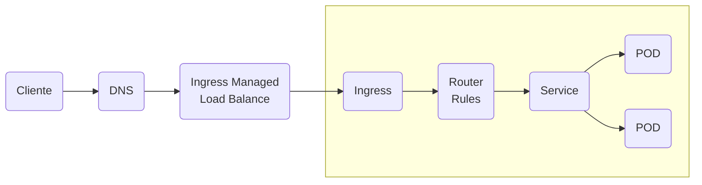

# Implementando Kubernetes en Máquinas Virtuales VMWare con Ubuntu 22.04.

## Ejemplo de nuestro Cluster Kubernetes en Ubuntu 22.04.

Para comenzar, veamos si tenemos nuestros Cluster Activo.

**Para esto nos conectamos al K8S Master.**

Ejecutamos los siguientes comandos.

* Validamos los Nodos Kubernetes.

```
$ kubectl get node
$ kubectl describe node k8smaster.k8s.local
```

* Validamos si Nginx Ingress esta activo.

```
$ kubectl get pods  -n ingress-nginx
$ kubectl get svc -n ingress-nginx
$ kubectl get service ingress-nginx-controller --namespace=ingress-nginx
```

**Revisemos un poco el ejemplo que implementaremos.**



El diagrama menciona que el **Cliente** realizará un **Request** (https://app.k8s.local), este se resolverá en el **DNS**, el cual tendrá la IP resolutiva para **app.k8s.local** (**app** es el subdominio del aplicativo que desplegaremos en el Cluster Kubernetes), esta IP es la asignada al momento de crear el **Service** en el Cluster de Kubernetes, que deberá estar en el rango IP's que asignamos anteriormente en MetalLB (192.168.123.230-192.168.123.235 ). 

Luego, el **DNS** redirigirá el requerimiento al **Ingress**, el cual, enrutará al **Service** correspondiente y este **Service** al **POD** disponible o  en Round Robin a los **POD's** replicados si corresponde la implementación.

Así logramos interactuar con un cliente desde el Cluster Kubernetes.

Vamos a crear nuestro archivo Manifiesto en formato YAML.

```
$ mkdir ~/k8sejemplo
$ cd ~/k8sejemplo
$ vi k8sejemplo.yml
```

```
apiVersion: v1
metadata:
  name: app-ejemplo
spec:
  finalizers:
    - kubernetes
status:
  phase: Active
---
kind: Pod
apiVersion: v1
metadata:
  name: app-ejemplo
  namespace: app-ejemplo
  labels:
    app: app-ejemplo
spec:
  containers:
    - name: app-ejemplo
      image: hashicorp/http-echo
      ports:
      - containerPort: 5678
      args:
        - "-text=ejemplo"
---
kind: Service
apiVersion: v1
metadata:
  name: app-ejemplo-service
  namespace: app-ejemplo
spec:
  selector:
    app: app-ejemplo
  ports:
  - port: 80
    protocol: TCP
    targetPort: 5678 
  type: LoadBalancer
---
kind: Ingress
apiVersion: networking.k8s.io/v1
metadata:
  name: app-ejemplo-ingress
  namespace: app-ejemplo
spec:
  ingressClassName: nginx
  rules:
  - host: app.k8s.local
    http:
      paths:
      - path: /
        pathType: Prefix
        backend:
          service:
            name: app-ejemplo-service
            port:
              number: 80
```
Un poco de la explicación del archivo **k8sejemplo.yml**.

El archivo k8sejemplo.yml de manifiesto contiene 4 secciones que comentaremos:
* **kind: Namespace**: Esta sección nos permite asignar un nombre a un espacio de trabajo en el Cluster como una separación en grupos de los contenedores. Adicionalmente, nos facilitará la administración de aplicaciones y de recursos en ele Cluster Kubernetes. Si omitimos el label namespace, todo lo relacionado al despliegue del aplicativo se creara en el namespace **default**.
*  **kind: Service**: En esta sección, definimos la política para acceder a los **Pod** o **Deployment** que desplegamos, que puertos se expondrán en el servicio para interactuar. Todo esto relacionado con la sección kind: Pod o kind: Deployment. 
* **kind: Pod**: En esta sección, definimos el aplicativos que desplegaremos en el namespace definido. Hay que recordar que el Pod, es la unidad mas pequeña que podemos crear en el Kubernetes y no necesariamente es permanente en el tiempo, o sea, puede estar constantemente en recreándose el Pod por decir de alguna manera simple de explicar.
* **kind: Ingress**: En esta sección, nos permite gestionar las reglas de enrutamiento del tráfico entrante a los servicios y aplicaciones dentro del Clúster Kubernetes. Definimos la entrada externa a nuestro servicio.

* **kind: Deployment**: Esta sección, la mas utilizada para las declarativas, no la utilizada para este ejemplo, principalmente esta relacionada con el **ReplicaSet** y los **Pod's** disponibles. Es la encargada de llevar la transición entre el estado actual en el que se encuentre el objeto hacia el estado deseado indicado por el usuario según lo recursos definidos en esta sección.

Vamos de desplegar este ejemplo:

```
$ kubectl apply -f k8sejemplo.yml
```

Verificamos el Despliegue.

```
$ kubectl get pods -n app-ejemplo
```

Veamos la IP que nos asigno en el Ingress desplegado en el Cluster Kubernetes.

```
$ kubectl get ingress -n app-ejemplo
```

Al ejecutar este ultimo comando, me entrego la siguientes información:

```
$ kubectl get service app-ejemplo-service -n app-ejemplo

NAME                  TYPE           CLUSTER-IP       EXTERNAL-IP       PORT(S)        AGE
app-ejemplo-service   LoadBalancer   10.104.180.176   192.168.123.231   80:30977/TCP   13m
```

De la cual podemos rescatar la IP asignada que corresponde a: **192.168.123.231** para nuestro subdominio **app**.

Si vamos al Browser y accedimos por IP (*http:/7192.168.123.231*), esto nos entregará como resultado **ejemplo**. Y si accedimos por DNS (http://app.k8s.local) nos entregaran **Hmm. We’re having trouble finding that site.** o **# No se puede acceder a este sitio web**, dependiendo del Browser que se utilice. La razón que nos entrega este ultimo error, es que no hemos registrado nuestro subdominio **app** en el DNS, entonces vamos a registrarlo.

**REGSITRANDO *app.k8s.local* en el DNS**

**Para esto nos conectamos al K8S DNS.**

Ejecutamos los siguientes comandos para agregar el subdominio al DNS.

```
$ sudo vi /etc/bind/db.k8s.local
```

Agregamos la siguiente línea al final. ***No olvidar que la IP 192.168.123.231*** es la IP de mi Cluster, aca deben considerar la IP que entrego en el comentario anterior.

```
app             IN      A       192.168.123.231
```

Una ves registrado, reiniciamos el DNS.

```
$ sudo systemctl restart bind9
$ sudo systemctl status bind9
```

Procedimos a validar si accedemos con el DNS.

```
$ ping app.k8s.local

$ curl http://app.k8s.local
```

Si todo sale bien y esta configurado correctamente, ya podemos disfrutar de nuestro Cluster Kubernetes en nuestro hogar u oficina.

