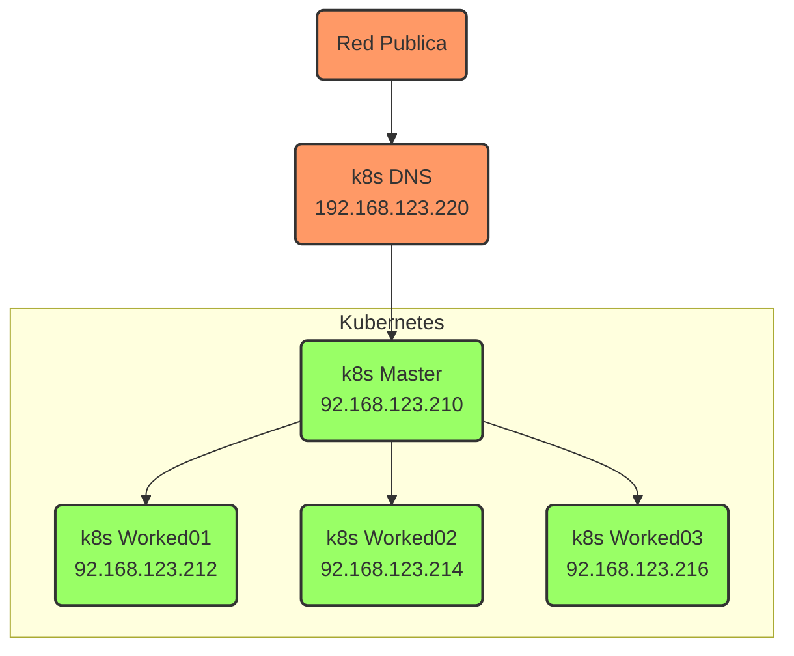

# Implementando Kubernetes en Máquinas Virtuales VMWare con Ubuntu 22.04.

Este tutorial esta orientado a la instalación y configuración de un Cluster Kubernetes en Ubuntu 22.04.

Toda información expuesta en este tutorial es publica y ha sido recopilada desde Blog, Foros y experiencia personal.

También, como comentario adicional, no se dará a conocer las diversas y/o comparaciones de instalaciones que se pueden realizar con otras Cloud (Nube) o On-Premise, el objetivo es crear un Cluster Kubernetes para tus desarrollos locales.

A medida que avancemos revisaremos algunos puntos importantes a considerar en la instalación de Kubernetes, como la integración del cluster a un balanceador si tenemos uno disponible en una red privada y/o local en casa. Caso contrario, implementaremos un balanceador en Kubernetes.

Tambien implementaremos un servidor DNS que nos ayudara a demostrar la implementación realizada.

## Descripción del Tutorial - Índice.
* Pre-Requisito Recomendado para esta Implementación.
* Creando la Máquina Virtual K8S Master.
	* Comenzamos con la Instalación de Kubernetes.
	* Iniciamos el Cluster Kubernetes.
	* Instalando el Plugin de Calico Network.
* Creando la Máquina Virtual K8S WORKED01.
	* Comenzamos con la Instalación de Kubernetes.
	* Nos Integramos al Cluster Kubernetes K8SMaster.
* Validamos la integración en el Nodo K8s Master.
* Instalando Balanceador de Carga MetalLB en Cluster Kubernetes.
* Instalando e Integrando con MetalLB en Cluster Kubernetes y Nginx Ingress.
* Creando la Máquina Virtual K8S DNS.
	* Comenzamos con la Instalación del DNS.
	* Iniciando el Servicio DNS.

La infraestructura que utilizaremos es:

**Nota**: Como caso practico, solo crearemos un Worked. Si desea crear más, solo deberá crear máquinas virtuales con las características que se mencionan para Worked01.

>k8s.local, es el dominio que se define para este tutorial. Asigne un nuevo nombre o uno existente en su organización de dominio si desea en este punto, asi como los nombre de los Host.


|Servidor        |HostName             |CPU          |RAM |IP              | HDD                            | Comentarios      |
|----------------|---------------------|-------------|----|----------------|--------------------------------|------------------|
|Master K8s       |k8smaster.k8s.local  |1vCPU 2 Core |4Gb |192.168.123.210 |20GB mínimo( 40Gb recomendado) |Salida a Internet |
|Worked01 K8s    |k8sworked01.k8s.local |1vCPU 2 Core |4Gb |192.168.123.212 |20GB mínimo( 40Gb recomendado) |Salida a Internet |

>Adicionalmente, crearemos un servidor de DNS para facilitar la exposición de los aplicativos y/o servicios desplegados en el Cluster Kubernetes.

|Servidor        |HostName             |CPU          |RAM |IP              | HDD                          | Comentarios      |
|----------------|---------------------|-------------|----|----------------|------------------------------|------------------|
|DNS K8s         |k8sdns.k8s.local     |1vCPU 2 Core |4gb |192.168.123.220 |20GB                          |Salida a Internet |



## Pre-Requisito Recomendado para esta Implementación.
Para facilitar este tutorial, recomiendo la siguiente estructura referencial para directorios, es opcional esta estructura.
En este repositorio encontraras un archivo **creadirectorio.bat** para facilitar esta actividad.
```
<U:>\VMK8s_Cluster
		\K8sDNS
			\VirtualDisk
		\K8sMaster
			\VirtualDisk
		\K8sWorked01	
			\VirtualDisk
```